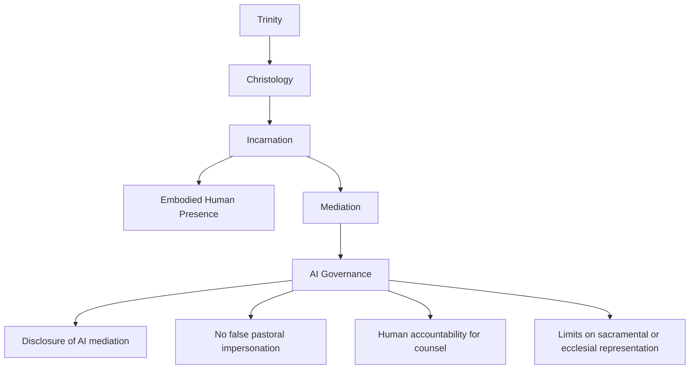

# Christology, Incarnation, and AI Mediation

## 1. Research question

How should Christian Christology, especially the incarnation, constrain AI systems that mediate speech, counsel, representation, presence, or delegated action?

## 2. Why this slice matters

The doctrine of the incarnation prevents Christian AI governance from treating communication, presence, embodiment, and accountable agency as interchangeable with text generation. AI can mediate information, but it is not an embodied person, pastor, elder, priest, counselor, sacramental presence, or accountable moral agent.

## 3. Candidate dependency map

## 4. Core thesis for review

Because Christian faith confesses that the Word became flesh, AI mediation should remain visibly mediated, bounded, and non-incarnational. AI may assist communication and preparation, but it should not impersonate embodied pastoral presence or make human accountability disappear.

## 5. Candidate implications

- AI-generated pastoral, theological, or institutional messages should disclose mediation where material.
- AI should not present itself as a pastor, church office, sacramental minister, or embodied community.
- Consequential spiritual, pastoral, disciplinary, or care decisions require human accountability.
- The system should preserve the difference between assistance, representation, and authoritative human presence.

## 6. Proposed next artifact

`docs/applications/ai-governance/christology-incarnation-ai-mediation-bridge.md`

## 7. Review questions

1. Which claims are direct Christological implications and which are prudential governance applications?
2. Should this bridge explicitly depend on a fuller `doctrine.christology` node first?
3. What forms of AI disclosure are required for Christian institutional use?
4. Where should pastoral, sacramental, or ecclesial limits be modeled?

## 8. Promotion checklist

Before promotion, strengthen source citations, check existing Christology nodes, preserve tradition scope, avoid creating pastoral-policy rules without review, and create only one bridge file first.
