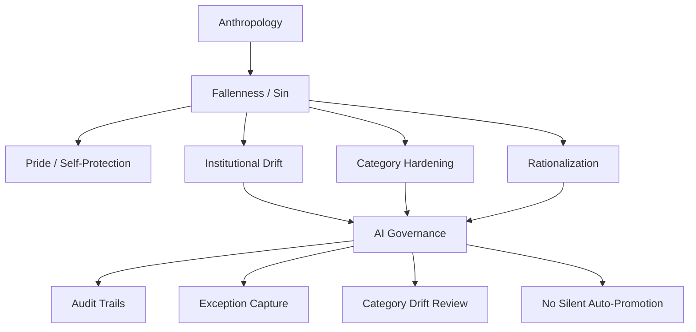

# Fallenness, Institutional Drift, and AI Safety

## 1. Research question

How should Christian doctrine of sin and fallenness shape AI governance so that institutions account for drift, rationalization, hidden incentives, category hardening, and misuse of power?

## 2. Why this slice matters

AI governance is often framed as if the main problem is model error. A Christian anthropology of fallenness widens the threat model: humans, institutions, incentives, workflows, and AI systems can all distort truth and responsibility.

This packet stages a bridge from fallenness into auditability, exception capture, category-drift review, and non-silent promotion rules.

## 3. Candidate dependency map

## 4. Core thesis for review

Because humans and institutions are fallen, AI governance should assume that systems will drift toward self-protection, speed, control, abstraction, or false certainty unless auditability, review, and exception learning are built into the architecture.

## 5. Candidate governance implications

### Implication 1: auditability is theological realism

Audit trails are not merely compliance artifacts. They acknowledge the risk of hidden motives, distorted incentives, pride, and unaccountable power.

### Implication 2: exceptions are moral signals

Recurring exceptions may indicate that the system is misclassifying, over-automating, hiding harm, or treating persons as categories.

### Implication 3: categories can become judgments

A category built for workflow routing can become a moral or institutional judgment if not reviewed.

### Implication 4: promotion must remain governed

AI outputs, inferred graph relations, and exception patterns may inform proposals, but they must not silently rewrite doctrine, governance, or canonical source material.

## 6. Proposed next artifact

`docs/applications/ai-governance/fallenness-institutional-drift-ai-safety-bridge.md`

## 7. What this packet prevents

This packet is designed to prevent:

- treating AI drift as only a technical problem;
- allowing categories to harden into hidden moral judgments;
- letting exception patterns silently rewrite doctrine or policy;
- building systems that optimize institutional self-protection while using moral language;
- hiding responsibility behind workflow automation.

## 8. Review questions

1. Which claims require a fuller doctrine of sin node before promotion?
2. How should Augustine, ordered love, pride, and power be connected?
3. Which governance controls belong in application bridges versus governance policy files?
4. How should the exceptions-lake layer capture moral and theological drift signals?

## 9. Promotion checklist

Before promotion:

- check existing exceptions-lake and governance files;
- clarify relationship to doctrine.sin and doctrine.anthropology;
- avoid creating new safety vocabulary without registry review;
- create one bridge file first;
- do not change validators in this pass.
