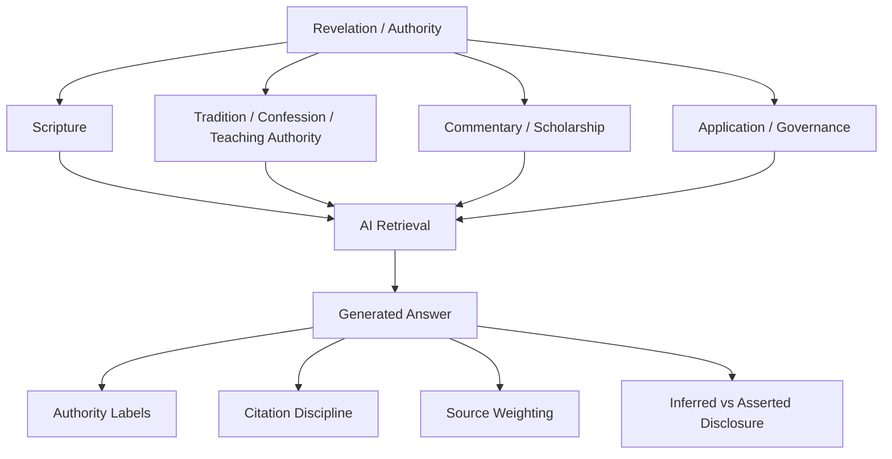

# Scripture, Authority, and AI Retrieval Governance

## 1. Research question

How should a Christian source-of-authority structure govern AI retrieval, ranking, citation, and synthesis so that generated outputs do not flatten Scripture, tradition, commentary, inference, and application into one undifferentiated authority layer?

## 2. Why this slice matters

This repository exists to make theological assumptions explicit before they become governance or technical architecture. Retrieval is one of the first places those assumptions can silently drift.

If an AI system retrieves five kinds of material and presents them in one confident voice, it can accidentally make:

- commentary sound like Scripture;
- generated synthesis sound like doctrine;
- tradition-specific claims sound like shared Christian core;
- inferred graph edges sound like asserted source evidence;
- application recommendations sound like moral authority.

This packet stages a source-hierarchy and retrieval-governance bridge.

## 3. Candidate dependency map

## 4. Core thesis for review

A Christian AI system should expose source status and authority scope at retrieval and rendering time.

It should not merely cite sources. It should tell the user what kind of source is being used and what role that source should play in the answer.

## 5. Candidate governance implications

### Implication 1: source type must remain visible

A generated answer should not hide whether a claim comes from Scripture, creed, confession, canon thinker, commentary, modern scholarship, application bridge, AI summary, or inferred relationship object.

### Implication 2: retrieval should respect source hierarchy

A retrieval system should not treat all text chunks as equivalent. Source status, trust zone, and tradition scope should influence ranking and display.

### Implication 3: AI should not synthesize across traditions without scope labels

When a claim is tradition-specific, the generated answer should mark the tradition scope rather than presenting the claim as universal.

### Implication 4: inferred edges require disclosure

If an answer depends on a derived graph relation rather than a direct source assertion, that should be disclosed.

### Implication 5: citation is not enough

A citation can prove that a text exists, but not that the text has the authority the answer implies. The authority level must be part of the rendering contract.

## 6. Proposed object plan

The likely first promoted artifact is an application bridge, not a doctrine rewrite.

Recommended next file:

`docs/applications/ai-governance/scripture-authority-retrieval-governance-bridge.md`

That bridge should define a practical AI retrieval and rendering posture:

- source type labels;
- authority tier labels;
- tradition-scope labels;
- asserted vs inferred disclosure;
- citation confidence boundaries;
- no equalization of source types.

## 7. What this packet prevents

This packet is designed to prevent:

- answer surfaces that imply equal authority for all retrieved sources;
- AI-generated synthesis presented as doctrine;
- tradition-specific claims presented as shared core;
- hidden reliance on inferred graph edges;
- retrieval output that is source-rich but authority-blind.

## 8. What this packet allows

This packet still allows semantic retrieval, graph-aware retrieval, multi-source synthesis, comparative answers, tradition-scoped rendering, and AI-assisted source discovery.

It is not anti-retrieval. It is anti-flattening.

## 9. Review questions

1. What authority tiers should the repository support by default?
2. Should source hierarchy differ by tradition profile?
3. Should application bridges be rendered with a lower authority label than doctrine nodes?
4. How should AI-generated summaries be marked in retrieval results?
5. Should inferred graph edges be shown by default or only after expansion?

## 10. Promotion checklist

Before promotion:

- check existing governance files for source-of-truth and retrieval language;
- verify whether a `doctrine.scripture_authority` or similar node exists;
- map source types to existing trust zones;
- avoid inventing new status values;
- create only a small bridge file first.
