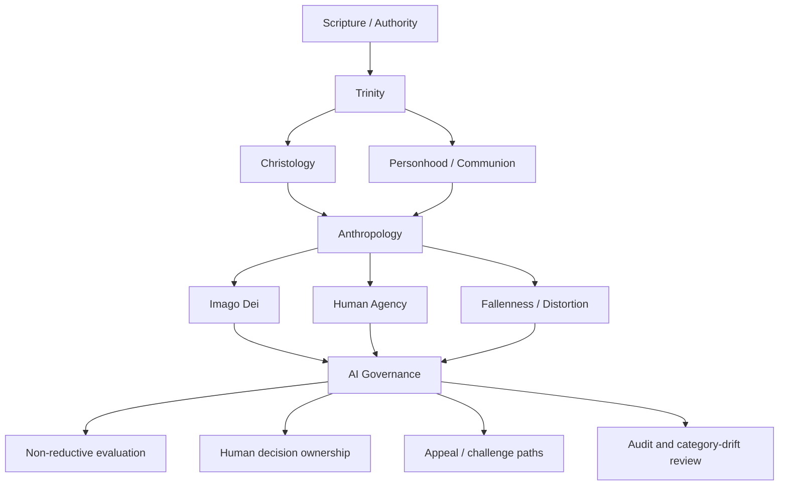

# Trinity to Anthropology to AI Governance Research Packet

## 1. Research question

How does Christian doctrine of the Trinity, especially the relation between divine communion and personhood, shape theological anthropology, and how should that anthropology constrain AI systems that classify, rank, automate, recommend, or delegate decisions affecting human persons?

## 2. Why this vertical slice matters

This slice is high leverage because it connects a stable upstream doctrine to a concrete governance outcome.

The repository already contains a worked example deriving anthropology into AI governance. This packet adds the upstream Trinity and personhood layer so the path becomes more explicit:

```text
Scripture / authority
-> Trinity
-> personhood / communion
-> anthropology
-> imago Dei / human agency
-> AI governance constraints
```

This is not meant to collapse every theological tradition into one view of personhood. It is a seed for a shared Christian core with room for tradition-specific overlays.

## 3. Source spine to verify before promotion

This packet proposes a source spine. It does not yet claim that all source work has been fully verified or cited.

### Scripture anchors

- Genesis 1:26-28 — image of God, blessing, dominion, creaturely vocation.
- Matthew 28:19 — triune baptismal name.
- John 1:1-18 — Word, creation, incarnation, revelation.
- John 14-17 — Father, Son, Spirit, indwelling, communion, mission.
- 2 Corinthians 13:14 — grace of Christ, love of God, fellowship of the Spirit.
- Colossians 1:15-20 — Christ as image, creation, reconciliation.

### Creedal and doctrinal anchors

- Nicene-Constantinopolitan Creed — stable triune confession.
- Chalcedonian Christology — Christ as true God and true human, relevant to anthropology through Christ as image and restored humanity.
- Patristic trinitarian grammar — especially person, relation, communion, procession, and worship.

### Theological lenses to review

- Augustine — ordered love, pride, power, humility, and moral disorder.
- Cappadocian / patristic personhood categories — with care not to over-modernize.
- Reformed and evangelical anthropology — imago Dei, stewardship, vocation, fall, moral responsibility.
- Orthodox social anthropology — personhood, communion, healing, deification, and image-bearing.

### Applied governance sources to review

- Existing Logos anthropology and AI governance files.
- Existing LAIRCA / AIRCA crosswalks.
- Existing application files under `docs/applications/ai-governance/`.
- Existing claim file for imago Dei constraining human dignity and non-reductive evaluation.

## 4. Core thesis for review

Christian AI governance should not begin with model capability. It should begin with the theological account of God, truth, personhood, agency, and responsibility.

If God is triune communion rather than isolated power, and if persons are created in the image of God, then human beings cannot be treated as merely machine-readable objects, optimization variables, or risk categories. AI systems may assist institutional judgment, but they must not dissolve human moral ownership, obscure dignity, or convert persons into abstractions without accountable review.

## 5. Candidate dependency map



## 6. Candidate claims for review

### Claim 1: Personhood is not reducible to function

Human beings may be described operationally, but they may not be treated as if the operational description exhausts their identity or worth.

AI governance implication:

> Model outputs, classifications, and rankings should not become totalizing judgments about persons.

### Claim 2: Human dignity is prior to system optimization

Efficiency is a real stewardship good, but it is not the highest good. Dignity, truth, justice, and accountable love constrain optimization.

AI governance implication:

> A workflow is not justified merely because it is faster, cheaper, or more consistent.

### Claim 3: Consequential judgment requires accountable ownership

If human beings are moral agents and institutions are morally accountable, then consequential decisions should not dissolve responsibility into opaque process.

AI governance implication:

> For decisions affecting discipline, exclusion, vocation, access, livelihood, pastoral care, or material dignity, a named human or accountable body should own the final commit point.

### Claim 4: Fallenness requires auditability

Neither humans nor systems are neutral. Bias, pride, fear, institutional self-protection, and category drift are predictable risks.

AI governance implication:

> AI-assisted workflows should include audit trails, review triggers, and periodic examination of whether categories are becoming hidden moral judgments.

### Claim 5: Communion shapes institutional design

If personhood is relational, then governance should preserve dialogue, explanation, challenge, and responsible participation rather than only output flow.

AI governance implication:

> Affected persons should not be trapped under unexplained automated process where meaningful challenge or human contact is appropriate.

## 7. Proposed object plan

The immediate implementation should be small. Do not attempt to build a full theology of the Trinity or anthropology in one pass.

Proposed review sequence:

1. Strengthen `docs/doctrine/trinity.md` with a pointer to downstream personhood and anthropology implications.
2. Strengthen `docs/doctrine/anthropology.md` with a pointer back to Trinity and Christology as upstream sources.
3. Add or strengthen a `concept.personhood` node if no adequate concept node exists.
4. Add an application bridge under `docs/applications/ai-governance/` only after source review.
5. Add candidate claim objects after the prose nodes are stable.

## 8. What Codex should not do yet

Codex should not:

- auto-promote this packet into canonical doctrine;
- overwrite existing doctrine nodes wholesale;
- create a large number of graph objects before relationship vocabulary review;
- invent new node types without checking governance files;
- treat proposed downstream AI governance constraints as equally authoritative with Scripture or creedal doctrine;
- create tradition-specific claims without explicit tradition scope.

## 9. Immediate high-value output

The best next build is a small reviewable bridge file:

`docs/applications/ai-governance/trinity-personhood-human-agency-bridge.md`

That bridge should show the derivation path without pretending the whole graph has already been built.

## 10. Review questions

1. Does the packet overstate the move from Trinity to personhood?
2. Which claims are shared-core Christian claims, and which require tradition-specific overlays?
3. Should `concept.personhood` be built before expanding anthropology?
4. Should Christology sit between Trinity and anthropology more explicitly in this slice?
5. Which governance constraints are direct implications, and which are prudential applications?

## 11. Promotion checklist

Before promotion, require:

- source citations strengthened;
- claim wording tightened;
- distinction between asserted and inferred claims preserved;
- relationship vocabulary checked;
- existing files updated by small patches rather than overwritten;
- sidecar generated only after the prose is accepted.
